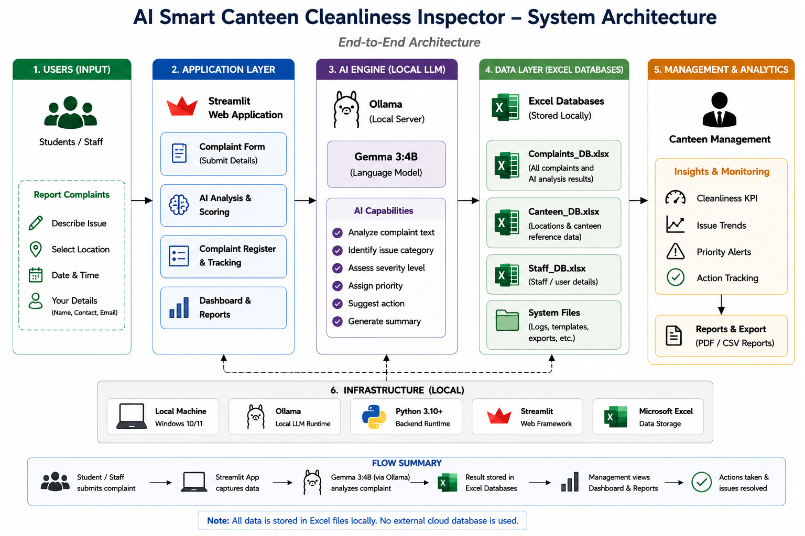
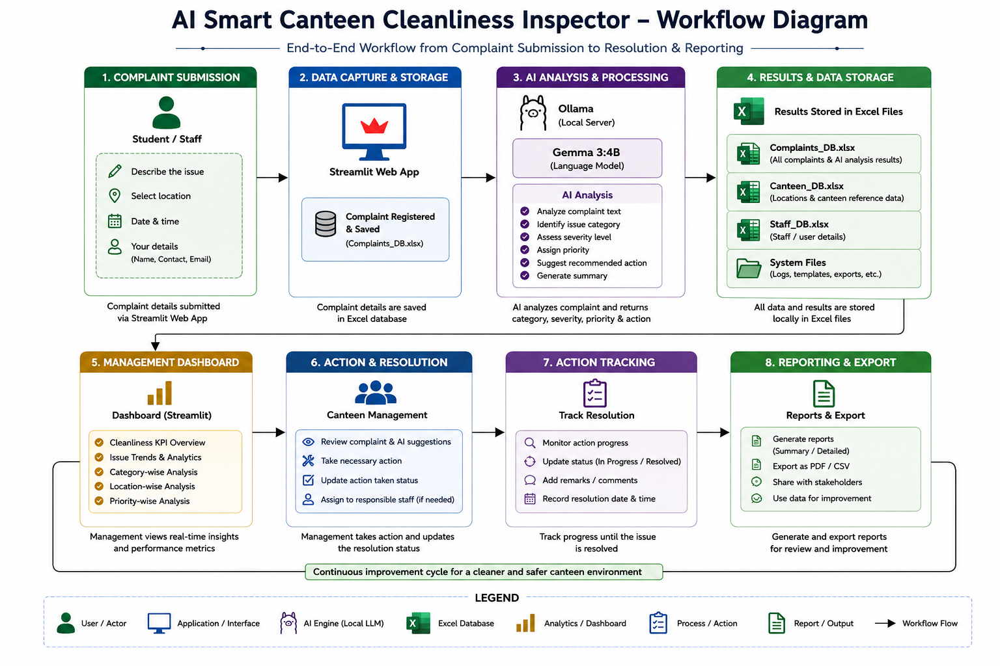

# AI Canteen Cleanliness Inspector

An AI-powered canteen cleanliness monitoring and complaint intelligence system that allows students to report cleanliness issues and uses a local Large Language Model (LLM) to analyse complaints, classify severity and priority, and provide management-level cleanliness insights.

## 📌 Problem Statement

Maintaining cleanliness in college canteens requires timely identification, reporting, and resolution of hygiene-related issues. Traditional complaint systems often depend on manual reporting and do not provide structured intelligence for management to identify recurring problems, high-priority issues, affected canteens, or staff performance.

The **AI Canteen Cleanliness Inspector** addresses this problem by combining complaint collection, local AI-based complaint analysis, Excel-based data storage, and management analytics in a single application.

## 🎯 Objectives

- Provide students with a simple interface to report canteen cleanliness issues.
- Automatically analyse complaints using an AI model.
- Categorise complaints based on the reported issue.
- Determine complaint severity and priority.
- Recommend appropriate corrective actions.
- Store complaint information for further analysis.
- Provide management with cleanliness and complaint analytics.
- Analyse complaint trends across canteens, issues, time periods, resolution status, and staff.
- Generate weekly and monthly management insights.

## ✨ Key Features

### 👨‍🎓 Student Complaint System

Students can submit:

- Canteen
- Table number
- Cleanliness issue
- Description of the problem

The system automatically generates and records:

- Complaint ID
- Reported time
- Issue category
- Severity
- Priority
- Status
- Staff assignment

### 🤖 AI Complaint Intelligence

The system uses **Gemma 3:4B**, running locally through **Ollama**, to analyse complaint descriptions.

The AI identifies:

- Issue category
- Severity
- Priority
- Recommended action
- Reason for the classification

The model runs locally rather than depending on a cloud-based LLM API.

### 📊 Management Intelligence Dashboard

The management dashboard provides:

- Total complaints
- Complaint status information
- Canteen-wise performance
- Issue-wise analysis
- Cleanliness issue trends
- Time-based complaint analysis
- Complaint resolution analysis
- Staff performance analysis
- Management KPIs
- Dashboard visualisations
- Weekly management data
- Monthly management data
- AI-generated weekly and monthly management reports

## 🧠 AI Model

| Component | Technology |
|---|---|
| Language Model | Gemma 3:4B |
| AI Execution | Ollama |
| Model Type | Local Large Language Model (LLM) |
| Application Interface | Streamlit |
| Data Storage | Microsoft Excel |

The AI model receives the reported issue and complaint description and produces structured complaint intelligence.

The system validates the AI response before storing the classification in the complaint database.

## 🏗️ System Architecture

The overall system architecture is shown below.



## 🔄 System Workflow

The end-to-end workflow from complaint submission to management reporting is shown below.



## 🛠️ Technologies Used

- **Python**
- **Streamlit**
- **Ollama**
- **Gemma 3:4B**
- **Pandas**
- **OpenPyXL**
- **Microsoft Excel**
- **Data Analytics and Visualisation**

## 📁 Project Structure

```text
AI-Canteen-Cleanliness-Inspector/
│
├── README.md
├── requirements.txt
├── app.py
├── Final_GenAI_Project.ipynb
│
├── Canteen_DB.xlsx
├── Complaints_DB.xlsx
├── Staff_DB.xlsx
│
└── docs/
    ├── architecture.png
    ├── workflow.png
    │
    └── screenshots/
        ├── Complaint Page.jpg
        ├── Complaint Analysis Result.jpg
        ├── Complaint Register.jpg
        ├── Dashboard Charts.jpg
        └── Dashboard KPI.jpg

## ⚙️ Installation

### Prerequisites

Make sure the following are installed:

- Python 3.9 or above
- Git
- Ollama

### Install Python Dependencies

Open Command Prompt in the project folder and run:

```bash
pip install -r requirements.txt

### Install and Run Gemma 3:4B

Install Ollama and download the required model:

```bash
ollama pull gemma3:4b

### 🚀 Usage

Run the Streamlit application from the project folder:

```bash
streamlit run app.py

## 📊 Management Analytics

The management dashboard provides analytical insights including:

- Total number of complaints
- High and critical complaints
- Immediate-priority complaints
- Reported and resolved complaints
- Canteen-wise complaint analysis
- Issue-wise complaint analysis
- Severity distribution
- Priority distribution
- Complaint records
- Time-based complaint analysis
- Complaint resolution analysis
- Staff performance analysis
- Weekly management data
- Monthly management data
- AI-generated weekly and monthly management reports

These analytics help management identify recurring cleanliness problems, high-risk issues, affected canteens, and complaint trends.

## 📸 Screenshots

### Student Complaint Page


### AI Complaint Analysis


### Management Dashboard – KPIs


### Management Dashboard – Charts


### Complaint Register


## 🔮 Future Enhancements

- Integrate the Staff Database with the AI system for intelligent staff assignment.
- Predict the most suitable staff member based on previous performance, workload, and assigned canteen.
- Automatically assign complaints to suitable staff members.
- Notify the head staff manager when high-priority complaints are reported.
- Extend the system with additional intelligent monitoring capabilities.

## ⚠️ Limitations

- The current system relies on students to report cleanliness issues.
- The AI analysis depends on the quality and completeness of the complaint description.
- The current complaint database uses Excel files, which may not be suitable for large-scale production deployment.
- Staff assignment is currently recorded as part of the complaint system and is not automatically predicted by the AI model.
- The system currently operates as a local application and requires Ollama and the Gemma model to be installed locally.

## 🔐 Privacy

The complaint analysis uses **Gemma 3:4B through Ollama locally**.

No cloud-based LLM API is required for complaint analysis.

Complaint information is stored in local Excel database files within the project environment.

Users should avoid entering unnecessary personal or sensitive information in complaint descriptions.

## 🎓 Academic Project

This project was developed as an academic project to demonstrate the practical application of:

- Generative AI
- Large Language Models
- Natural Language Processing
- AI-assisted decision support
- Data analytics
- Streamlit application development
- Local AI model deployment
- Excel-based data management

The project demonstrates how a local LLM can be combined with a complaint management system and analytical dashboard to support cleanliness monitoring and management decision-making.